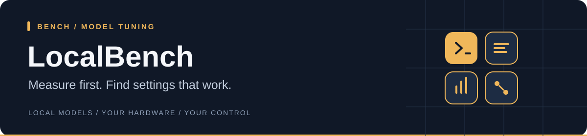

<div align="center">
  <h1>LocalBench</h1>
  <p><strong>Find the fastest stable local-model settings for your machine.</strong></p>
  <p><a href="#install-localx">Install</a> · <a href="#tune-a-model-you-already-use">First use</a> · <a href="#updates-and-troubleshooting">Updates &amp; help</a> · <a href="docs/README.md">All guides</a></p>
  <p>
    
    
    
    
  </p>
</div>

LocalBench benchmarks the models and runtimes you already use through
[LocalBox](https://github.com/C0deGeek-dev/LocalBox). It measures real workloads,
checks stability, explains the trade-offs, and exports a profile you can use
again instead of tuning by feel.

| At a glance | |
|---|---|
| **Use it when** | A model runs, but you do not know which settings are actually best |
| **It measures** | Hardware fit, prompt processing, generation, memory pressure, and stability |
| **It produces** | Recommendations, Markdown reports, and LocalBox-compatible AutoBest profiles |
| **Default goal** | Responsive coding sessions, including how quickly the model reads a prompt |

<a name="quick-start"></a>

## Install LocalX

**No programming tools or compilation required.** The installer downloads ready-to-run
applications and checks their SHA-256 checksums. You get **LocalBox, LocalPilot,
LocalMind, and LocalBench**, plus `localx` for managing them and the llama.cpp
engine for running models. You do not need to clone this repository.

### 1. Run the installer

**Windows 10/11 (64-bit Intel or AMD):** open the Start menu, type **PowerShell**,
and open it. Paste this command, then press **Enter**:

```powershell
irm https://raw.githubusercontent.com/C0deGeek-dev/LocalPilot/main/install/install.ps1 | iex
```

**Linux (x86-64 or ARM64) / macOS (Apple Silicon):** open **Terminal**, paste
this command, then press **Enter**:

```sh
curl -fsSL https://raw.githubusercontent.com/C0deGeek-dev/LocalPilot/main/install/install.sh | sh
```

### 2. Let your terminal find the commands

`PATH` is the list of folders your terminal searches for applications. Add the
LocalX folder once so commands such as `localx update` work from any directory.

<details>
<summary><strong>Windows — paste this into the same PowerShell window</strong></summary>

```powershell
$localxBin = Join-Path $env:LOCALAPPDATA 'localx\bin'
$userPath = [Environment]::GetEnvironmentVariable('Path', 'User')
if (($userPath -split ';') -notcontains $localxBin) {
    [Environment]::SetEnvironmentVariable('Path', "$localxBin;$userPath", 'User')
}
$env:Path = "$localxBin;$env:Path"
```

This enables the commands in this window and saves the setting for future
terminals. If another open terminal cannot find them, close and reopen it.

</details>

<details>
<summary><strong>Linux / macOS — add LocalX to your shell's PATH</strong></summary>

Paste this into your terminal:

```sh
export PATH="${XDG_DATA_HOME:-$HOME/.local/share}/localx/bin:$PATH"
```

To keep it for future terminals, add the same line to your shell configuration:
`~/.bashrc` for Bash or `~/.zshrc` for Zsh. Use the directory printed by the
installer if it differs.

</details>

### 3. Check the installation

```sh
localx status
```

You should see the installed tools and engine. **Installing the tools does not
download an AI model**; choose one when you start using LocalBox.

Want to read the installer before running it, check platform support, or install
a specific version? See the [installation guide](https://github.com/C0deGeek-dev/LocalPilot/blob/main/docs/install.md).

## Tune a model you already use

**Start with a working LocalBox model.** If you have not chosen one yet, run
`localbox` to open the guided launcher. LocalBench uses LocalBox's catalog and
model engine to measure real runs on your hardware.

List the model keys:

```sh
localbox info
```

Then tune one of them:

```sh
localbench findbest --model <model-key>
```

Replace `<model-key>` with a key from that list; do not type the angle brackets.
To target a specific context size, add `--context <context-key>` using a value
shown by `localbox info <model-key>`.

**What happens next:** LocalBench tests settings, checks stability, and saves the
winner to `~/.local-llm/tuner/best-<key>.json`. LocalBox can use that saved profile
on later launches. Tuning runs real workloads and can take time.

| I want to… | Start here |
|---|---|
| Find settings for one model | `localbench findbest --model <model-key>` |
| Understand the tuning choices | [Tuning guide](docs/tuning.md) |
| Explore benchmarks and evaluation | [Command reference](docs/command-surface.md) |

## Updates and troubleshooting

| I want to… | Run |
|---|---|
| Update the whole stack and model engine | `localx update` |
| See installed versions | `localx status` |
| Diagnose installation problems | `localx doctor` |
| Retry an incomplete installation | `localx install` |

Ordinary installs use published releases; updates do not require Rust or Git.
If a command is “not recognized” or “not found”, complete the PATH step above.
If an older installation is taking precedence, `localx doctor` identifies it;
review its findings before using `localx doctor --fix` to remove old copies.

## Privacy by design

LocalBench measures your machine locally and writes results for you, not for us.

- **No usage telemetry is sent.** Hardware measurements, prompts, scores, and
  benchmark results are not reported to LocalX or an analytics service.
- **Local endpoints only.** The default tuning and evaluation path runs against
  models on your own machine.
- **You own every result.** Reports, caches, and exported profiles are ordinary
  local files you can inspect, move, keep, or delete.
- **No account required.** Benchmarking does not require a LocalX account or a
  hosted API key.

## What question does it answer?

Given a machine, model, runtime, context target, and quality policy, LocalBench
answers:

- Will this combination fit comfortably?
- Which settings are fastest without crossing the quality boundary?
- What should I use for coding, chat, or long-context work?
- Why was this profile chosen over the fastest isolated trial?

```text
machine + model + workload
            │
            ▼
      bounded search ──> stability checks ──> scored recommendation
                                                    │
                                                    └── report + AutoBest profile
```

## Sensible defaults

`localbench findbest` optimizes for `coding-agent` by default. That score
models the end-to-end feel of Claude Code or LocalPilot work, where a large
prompt often dominates latency. Use `--optimize gen` only when decode
throughput is the thing you explicitly care about.

Every result is measured through `llama-server` — the same binary LocalBox
will actually launch — as templated `/v1/chat/completions` traffic under the
same single-session launcher defaults. It is never approximated with
`llama-bench` numbers: `llama-bench` only screens which candidates of a cheap
phase get a server trial, and llama.cpp's own memory fitter only says where a
candidate fits. Typed failures and a per-run manifest keep an unusable
HTTP/schema/content response out of ranking while preserving its evidence.

> [!NOTE]
> `--profile balanced` discounts a winner by its measured risk signals. On a
> live run those are within-run throughput variance and cross-phase stability;
> the richer free-VRAM/RAM/CPU headroom factors need host telemetry the live
> runner does not yet collect, so a live balanced result can track `pure`
> closely (see [Tuning](docs/tuning.md)). The findbest output's `confidence`
> field says which case you got: `full` when every factor saw its input,
> `partial` otherwise.

## Project status

The tuning engine and its search, scoring, and export pipeline are mature and
golden-tested against the pinned scoring behaviour. The binary also carries
the harness-capability benchmark (`arms`, `rescore`) and the lesson-uplift
A/B (`uplift`); live full-matrix runs against a local model are opportunistic.
An arm spec can also name a scripted coach that drives the solver over its MCP
surface, adding an interventions count to the scorecard and report — see
[the coached arm](docs/external-runner.md#the-coached-arm-scripted-coach-over-mcp).

## Documentation

| Topic | Guide |
|---|---|
| CLI commands | [Command surface](docs/command-surface.md) |
| Search phases, scoring, and flags | [Tuning](docs/tuning.md) |
| Capability benchmark and uplift A/B | [External runner](docs/external-runner.md) |
| Launcher boundary | [Launcher contract](docs/launcher-contract.md) |
| Repository structure | [Architecture](docs/architecture.md) |
| Full documentation map | [Docs index](docs/README.md) |

## LocalX

LocalBench is the measurement layer in the
[LocalX toolchain](https://c0degeek-dev.github.io/LocalStack/):

| Project | Role |
|---|---|
| [LocalBox](https://github.com/C0deGeek-dev/LocalBox) | Run local models |
| **LocalBench** | Find fast, stable settings |
| [LocalPilot](https://github.com/C0deGeek-dev/LocalPilot) | Code through the agent harness |
| [LocalMind](https://github.com/C0deGeek-dev/LocalMind) | Turn reviewed sessions into reusable project memory |

Release history lives in [CHANGELOG.md](CHANGELOG.md).

<details>
<summary><strong>Build from source (developers only)</strong></summary>

The ready-to-run installation above is sufficient for normal use. Building from
source requires Rust and the platform build tools. Run these commands from the
repository checkout unless a clone command is shown:

```sh
cargo install --path crates/localbench --locked
```

</details>

## License


LocalX-owned source is available under the
[PolyForm Noncommercial License 1.0.0](LICENSE). Commercial use requires a
separate license. See [LICENSING.md](LICENSING.md) for the commercial contact,
the 30 August 2026 licensing boundary, and third-party terms.
